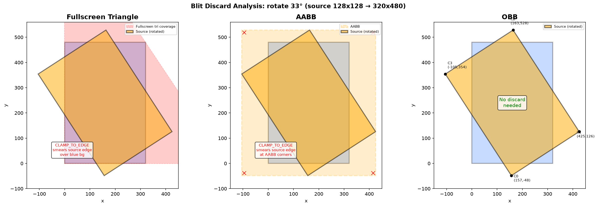

# Blit Discard 删除分析

## 问题

blit_native.frag 中有一段 discard 逻辑，UV 超出 [0,1] 时丢弃片元。目标是删掉 discard，让 FS 简化为纯 `texture()` 调用。

删除后在全屏三角形和 AABB 路径上出现颜色错误，OBB 路径正常。以下是原因分析。

## rotate 测试场景

```
target: 320x480, 蓝色背景 (0xFFFF0000)
source: 128x128, 缩放到 320x480 后绕中心旋转 33°
blend:  BLEND_NONE
filter: BI_LINEAR
sampler addressMode: CLAMP_TO_EDGE
```

source 旋转后 4 个角的坐标：

| 角 | 源图坐标 | 旋转后 | 超出 target 方向 |
|---|---|---|---|
| C0 | (0, 0) | (157, -48) | 顶部 |
| C1 | (320, 0) | (425, 126) | 右边 |
| C2 | (320, 480) | (164, 528) | 底部 |
| C3 | (0, 480) | (-105, 354) | 左边 |

旋转后 source 的实际覆盖区域是一个倾斜矩形，4 个角都超出 target 边界。target 四角附近的像素不在 source 覆盖范围内。



## AABB 路径为什么出错

AABB = (-105, -48) ~ (425, 528)，尺寸 530x576。比 target (320x480) 还大。

target 左上角附近像素，例如 (5, 5)：

1. (5, 5) 在 AABB 矩形内 → 光栅化生成 fragment
2. FS 通过逆矩阵反算到 source 坐标 → 得到 (-80, -120) 左右
3. UV = (-80/128, -120/128) ≈ (-0.625, -0.937)
4. **有 discard**：UV < -0.001 → discard → 像素保留蓝色背景
5. **删掉 discard**：CLAMP_TO_EDGE 把 UV 钳到 (0, 0) → 取 source 角落像素颜色 → 蓝色背景被覆盖

AABB 四个角落区域都是这样：几何上在矩形内会执行 FS，但 UV 超出 [0,1]，CLAMP_TO_EDGE 把 source 边缘色拉伸过来。

全屏三角形同理，而且更严重——整个 target 都在三角形内，所有非 source 覆盖区的像素都会被 source 边缘色覆盖。

## OBB 路径为什么没问题

OBB 四边形的 4 个顶点 = source 旋转后的 4 个角 (157,-48), (425,126), (164,528), (-105,354)。

target (5, 5) 不在这个倾斜四边形内 → 不生成 fragment → 不执行 FS → 保留蓝色背景。

OBB 内的像素，UV 都在 [0,1] 范围内（因为四边形精确映射 source），CLAMP_TO_EDGE 不触发，不需要 discard。

## 4 个角的实际计算

source 是 128x128，矩阵 = T(160,240) × R(33°) × T(-160,-240) × S(2.5, 3.75)。

对每个 source 角 (sx, sy)：
1. 缩放：(sx * 2.5, sy * 3.75)
2. 平移到原点：减 (160, 240)
3. 旋转 33°：cos=0.8387, sin=0.5446
4. 平移回去：加 (160, 240)

| source 角 | 缩放后 | 旋转后 |
|---|---|---|
| (0, 0) | (0, 0) | (157, -48) |
| (128, 0) | (320, 0) | (425, 126) |
| (128, 128) | (320, 480) | (164, 528) |
| (0, 128) | (0, 480) | (-105, 354) |

AABB = min/max = (-105, -48) ~ (425, 528)。

## 解决方案

两个 fragment shader：

| Shader | 路径 | discard |
|---|---|---|
| `blit_native.frag` | OBB | 无 |
| `blit_native_fs.frag` | 全屏三角形 | 有 |

OBB 不需要 discard。全屏三角形必须有 discard，否则 CLAMP_TO_EDGE 会让 source 边缘色覆盖整个 target。

## 测试结果

| Config | VGLITE_BLIT_MSAA | VGLITE_BLIT_OBB | 结果 |
|---|---|---|---|
| 1 | 1 | 1 | 37 PASS / 1 FAIL |
| 2 | 1 | 0 | 37 PASS / 1 FAIL |
| 3 | 0 | 1 | 37 PASS / 1 FAIL |
| 4 | 0 | 0 | 37 PASS / 1 FAIL |

1 FAIL = test_sft_blit (pre-existing crash)。
